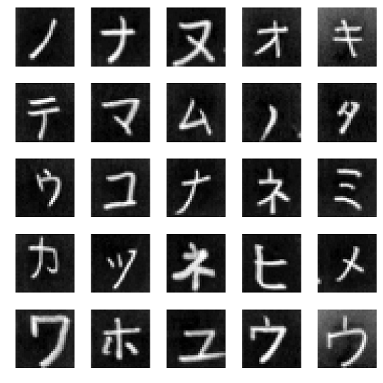
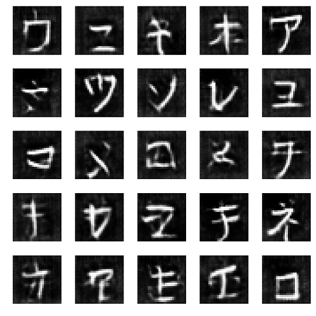

# 敵対的生成ネットワーク（Generative Adversarial Networks, GAN）による手書きカタカナ文字の生成（Kerasでの実装）

## 

## 手書きカタカナ文字のデータについて
手書きのカタカナ文字の画像データはETLデータベースに公開されているデータを利用させていただいています。



## GANについて

[How to Train a GAN? Tips and tricks to make GANs work](https://github.com/soumith/ganhacks)によるアドバイスを反映しています：
* スパースな勾配を避けるために、Fully convolutionalネットワーク構造とLeakyReLUを採用
* 画像を[-1, 1]に正規化し、tanhの活性化関数で生成
* 実画像と偽造画像を別々のバッチでDiscriminatorを学習させる
* **z**は、Uniform分布ではなく、正規分布から生成

## 使い方
notebooks/main_ETL6_katakana.ipynbに使い方の例を示しています。

### DCGANの定義
指定可能なDCGAN hyperparameterに関してはkerasdcgan/models.pyをご参照ください。
```python
from kerasdcgan.models import DCGAN

dcgan = DCGAN()
dcgan.build()
dcgan.summary()
```

### バッチで学習（Dを１ステップ、Gを１ステップ学習する）
```python
# x_train_batch is a batch of real images (numpy.ndarray of shape (samples, height, width, 1))
d_metrics, stacked_metrics = dcgan.train_on_batch(x_train_batch, freeze_discriminator=True)
```

### **z**の生成
```python
# Generate 25 noise samples
noise_samples = dcgan.generate_noise(25)
```

### 偽造画像の生成
```python
noise_samples = 25
# noise_samples = dcgan.generate_noise(25)  # This also works
generated_images = dcgan.generate(noise_samples)
```

### 画像データの作成
```python
from itertools import product
from kerasdcgan.etl import read_etl6_data, data2array

data = read_etl6_data('/path/to/etl6_files')
x_all, y_all = data2array(data, new_shape=(28, 28))

# Get katakana images
katakana = [''.join(e) for e in product(' KSTNHMYRW', 'AIUEO')] + [' N']
katakana_idx = [i for i, label in enumerate(y_all) if label in katakana]
x_train = x_all[katakana_idx]
```

## 結果サンプル
### 偽造画像のサンプル


### 偽造画像の進化のアニメーション


## Repository info
### Requirements
* tensorflow-gpu==1.2.1
* Keras==2.0.8
* numpy==1.13.3
* Pillow==4.3.0
* pandas==0.20.3

### データ
* [ETL文字データベース](http://etlcdb.db.aist.go.jp/?lang=ja) (ETL6を利用)
